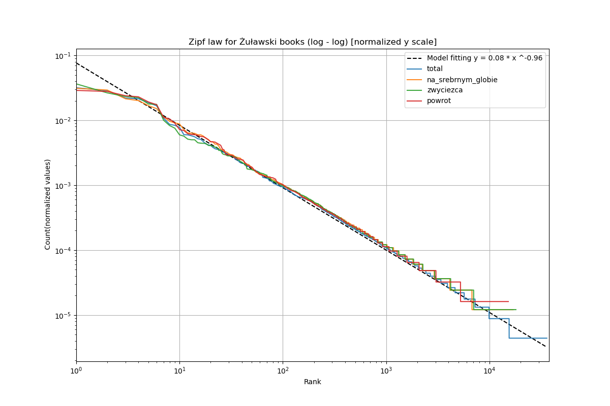

# Natural language processing 📜
## 👤 Author: **Jakub Figura**
 
The repository contains solutions from exercises in natural language processing at the Jagiellonian University.

# Table of Contents

1. [Power laws in linguistics](#Lab1)
2. [Needleman-Wunsch Algorithm](#Lab2)
3. [N-grams](#Lab3)
4. [Tokenizers, BPE](#Lab4)

## Power laws in linguistics

The task involved analyzing a corpus of texts and examining the distribution of words. The analysis establish that chosen corpus of texts written by Andrzej Żuławski follows empirical linguistic laws such as Zipf's law and Heaps-Herdan's law. 

According to Zipf's law:   $\text{word frequency} \propto \frac{1}{\text{word rank}}$

The distribution is usually ilustrated via log-log plot. Here I plot it with fitted regression model.

