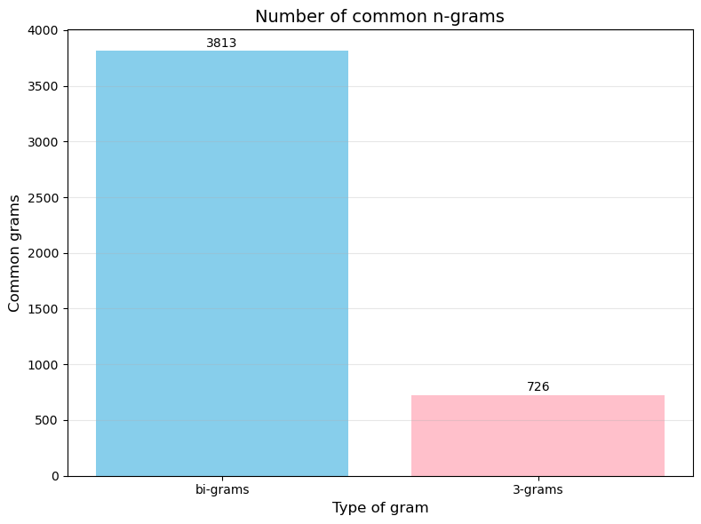

# Natural language processing 📜
## 👤 Author: **Jakub Figura**
 
The repository contains solutions from exercises in natural language processing at the Jagiellonian University.

# Table of Contents

1. [Power laws in linguistics](#Lab1)
2. [Needleman-Wunsch Algorithm](#Lab2)
3. [N-grams](#Lab3)
4. [Tokenizers, BPE](#Lab4)

## Power laws in linguistics

The task involved analyzing a corpus of texts and examining the distribution of words. The analysis establish that chosen corpus of texts written by Andrzej Żuławski follows empirical linguistic laws such as Zipf's law and Heaps-Herdan's law. The analyzed data comes from European Literary Text Collection 

[Link to notebook](https://github.com/jakubfigura/nlp_lab/blob/main/lab1/language_laws.ipynb)

According to Zipf's law:   $\text{word frequency} \propto \frac{1}{\text{word rank}}$

The distribution is usually ilustrated via log-log plot. Here I plot it with fitted regression model.

European Literary Text Collection (ELTeC), version 1.1.0, April 2021, edited by Carolin Odebrecht, Lou Burnard and Christof Schöch. COST Action Distant Reading for European Literary History (CA16204). DOI: doi.org/10.5281/zenodo.4662444. (https://github.com/COST-ELTeC/ELTeC)

## Needleman-Wunsch Algorithm

The Needleman-Wunsh algorithm is an algorithm which is used in bioinformatics to align protein and nucleotide sequences. In this excercise I provided the implementation of the algorithm in python following the pseudocode and very good explanation from Wikipedia (see. https://en.wikipedia.org/wiki/Needleman–Wunsch_algorithm). The algorithm was used to study similarity of Grimm Brothers Letters which where read using various methods of handwriting recognition. 

## N-grams 

The excercies involved counting n-grams in Witkacy Books. 
